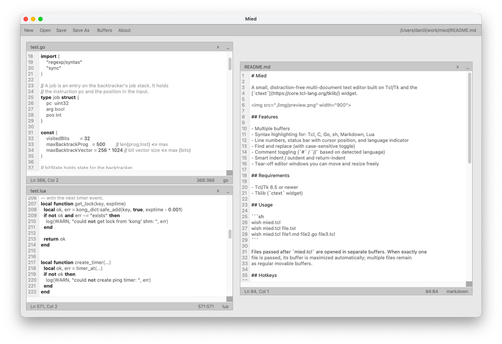

# Mied

A small, distraction-free multi-document text editor built on Tcl/Tk and the
[`ctext`](https://core.tcl-lang.org/tklib/) widget.



## Features

- Multiple buffers
- File tree buffers that follow the filesystem as it changes
- Syntax highlighting for: Tcl, C, PHP, Go, sh, Markdown, Lua, one file per
  language in `langs/`
- Line numbers, status bar with cursor position, and language indicator
- Find and replace (with case-sensitive toggle)
- Comment toggling (`#` / `//` based on detected language)
- Smart indent / outdent and return-indent
- Tear-off editor windows you can move and resize freely

## Requirements

- Tcl/Tk 8.5 or newer
- Tklib (`ctext` widget)

## Usage

```sh
wish mied.tcl
wish mied.tcl file.txt
wish mied.tcl file1.md file2.go file3.tcl
wish mied.tcl -config mied.conf.example file.txt
```

### Options

| Option            | Description                                        |
| ----------------- | -------------------------------------------------- |
| `-config <file>`  | Load editor configuration from a Tcl config file   |

Files passed after `mied.tcl` are opened in separate buffers. When exactly one
file is passed, its buffer is maximized automatically; multiple files remain
as regular movable buffers.

## Configuration

By default Mied uses its built-in color, font, and highlight settings. Pass a
config file with `-config` to override them:

```sh
wish mied.tcl -config my-theme.conf
```

A config file is a plain Tcl script that sets `Config(...)` keys; keys it does
not set keep their default values. See [mied.conf.example](./mied.conf.example).

## Hotkeys

| Key                  | Action                                |
| -------------------- | ------------------------------------- |
| `Ctrl`+`N`           | New untitled buffer                   |
| `Ctrl`+`O`           | Open file…                            |
| `Ctrl`+`T`           | New file tree buffer                  |
| `Ctrl`+`S`           | Save                                  |
| `Ctrl`+`B`           | Toggle sidebar                        |
| `Ctrl`+`F`           | Show find bar                         |
| `Ctrl`+`Tab`         | Next buffer                           |
| `Ctrl`+`Shift`+`Tab` | Previous buffer                       |
| `Ctrl`+`S`           | Save                                  |
| `Ctrl`+`W`           | Close buffer                          |
| `Ctrl`+`L`           | Select current line                   |
| `Ctrl`+`/`           | Toggle `#`/`//` comment               |
| `Enter`              | Re-indent new line (preserves indent) |
| `Tab`                | Indent selection / current line       |
| `Shift`+`Tab`        | Outdent selection / current line      |


### Find bar

| Key               | Action                    |
| ----------------- | ------------------------- |
| `Enter` (Find)    | Find next match           |
| `Enter` (Replace) | Replace match + find next |
| `Escape`          | Hide find bar             |

Mouse buttons on the find bar:

| Button  | Action                |
| ------- | --------------------- |
| `Aa`    | Toggle case-sensitive |
| `<`     | Find previous match   |
| `>`     | Find next match       |
| `Repl`  | Replace & find next   |
| `ReAll` | Replace all matches   |
| `x`     | Close find bar        |

### File tree

`Ctrl`+`T` (or the `Tree` toolbar button) opens a file tree buffer for the
directory of the active buffer, or for the working directory when no file is
open. The tree is a normal buffer: it appears in the sidebar, can be moved,
resized, minimized, and closed like any other.

| Action                   | Result                                   |
| ------------------------ | ---------------------------------------- |
| Double-click a file      | Opens it in a new editor buffer          |
| Double-click a directory | Expands or collapses it                  |
| Click a directory arrow  | Expands or collapses it                  |
| `Enter`                  | Same as double-clicking the selected row |
| `Ctrl`+`H`               | Shows or hides hidden (dot) entries      |
| `F5`                     | Re-reads the tree from disk              |
| `...` (title bar)        | Picks another root folder                |
| `.*` (title bar)         | Same as `Ctrl`+`H`                       |

Directories are read the first time they are expanded, and the tree re-reads
the expanded part of the tree every couple of seconds, so files created or
deleted outside Mied show up on their own.

Hidden entries (names starting with a dot) are left out by default to keep the
tree tidy; `Ctrl`+`H` or the `.*` button lists them as well, and the button is
filled in while they are shown.

### Toolbar buttons

| Button  | Action                |
| ------- | --------------------- |
| New     | New untitled buffer   |
| Open    | Open file…            |
| Tree    | New file tree buffer  |
| Save    | Save                  |
| Save As | Save as…            |
| Buffers | Toggle sidebar      |
| About   | About dialog        |

## Building a standalone binary

Mied can be wrapped into a single executable with [tclexecomp](https://tclexecomp.sourceforge.net/):

Linux / macOS:
```sh
scripts/build-unix.sh
```

Windows: 
```bat
scripts\build-windows.cmd
```

Both scripts copy `mied.tcl`, `img/icon.png`, `langs/*.lang`, and `LICENSE`
into `build/wrap/`, compile the script to bytecode, run tclexecomp with
`-forcewrap`, and leave the finished binary in `dist/`: `mied` on Linux, `mied.mac` on macOS, `mied.exe` on
Windows. tclexecomp is not bundled: put its binary for the host platform on
`PATH`, or point at it with `--tool <path>`. Build on the platform you target.

| Option          | Description                                                  |
| --------------- | ------------------------------------------------------------ |
| `--no-compile`  | ship readable Tcl instead of bytecode                        |
| `--clean`       | remove `build/` and `dist/` before building                  |
| `--tool <path>` | tclexecomp binary to run                                     |
| `--name <name>` | name of the output binary (default: `mied`)                  |

Bytecode keeps the source out of the binary and needs `tbcload`, which the
stock tclexecomp binaries include; use `--no-compile` if you customized the
stub and removed that module. Run either script with `--help` for the details.

Both scripts compare the finished binary against the stub and fail loudly if it
holds no payload, so a build that tclexecomp aborted never reaches `dist/`.
